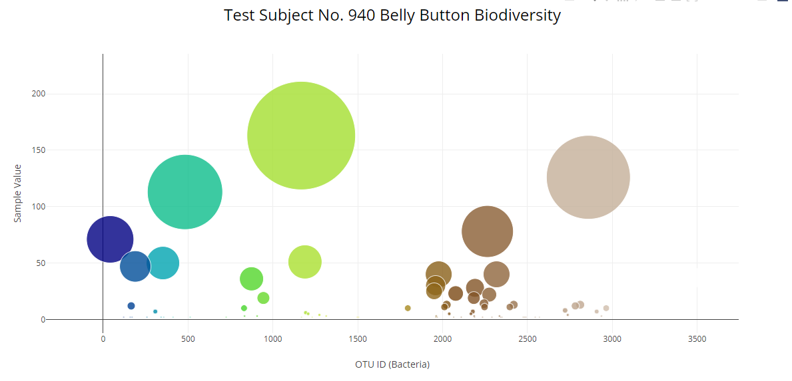
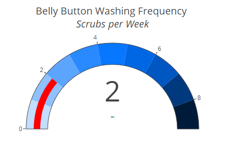
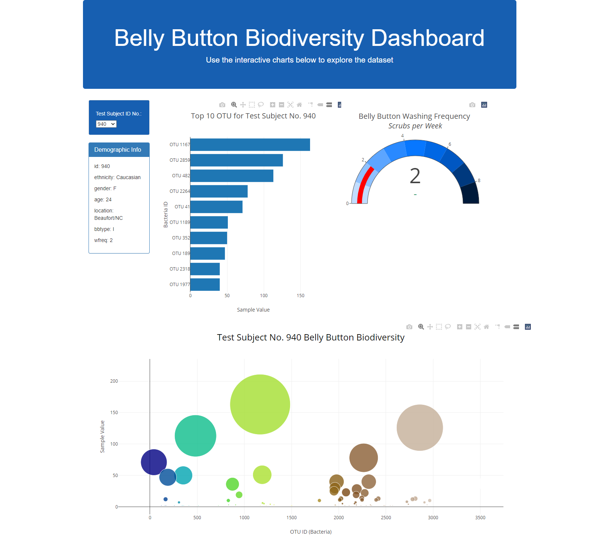

# Plotly-challenge
# Belly Button Biodiversity

## Background

In this project, an interactive dashboard was built to explore the [Belly Button Biodiversity dataset](http://robdunnlab.com/projects/belly-button-biodiversity/), which catalogs the microbes that colonize human navels.

The dataset reveals that a small handful of microbial species (also called operational taxonomic units, or OTUs, in the study) were present in more than 70% of people, while the rest were relatively rare.

Use the interactive charts below to explore the dataset. Select a test subject ID number in a dropdown menu to see the relative sample results.

## Plotly - Bar Chart

The Plotly bar chart use the D3 library to read in `samples.json`, and create a horizontal bar chart with a dropdown menu to display the top 10 OTUs found in that individual.

## Plotly - Bubble Chart

A bubble chart was created that displays each sample for the folowing values:
* `otu_ids` for the x values.

* `sample_values` for the y values.

* `sample_values` for the marker size.

* `otu_ids` for the marker colors.

* `otu_labels` for the text values.

## Gauge Chart

 Gauge Chart was created to plot the weekly washing frequency of the individual.

 

 ## Dashboard Deployment

Click the following link to see how it looks like [Belly Button Biodiversity Dashboard.](https://jessicapardo.github.io/Plotly-challenge/)

To view the [JavaScript Code](static/js/app.js)
To view the [HTML code](index.html)
To view [Data](data/sample.json)

### About the Data

Hulcr, J. et al.(2012) _A Jungle in There: Bacteria in Belly Buttons are Highly Diverse, but Predictable_. Retrieved from: [http://robdunnlab.com/projects/belly-button-biodiversity/results-and-data/](http://robdunnlab.com/projects/belly-button-biodiversity/results-and-data/)

- - -

© 2019 Trilogy Education Services

